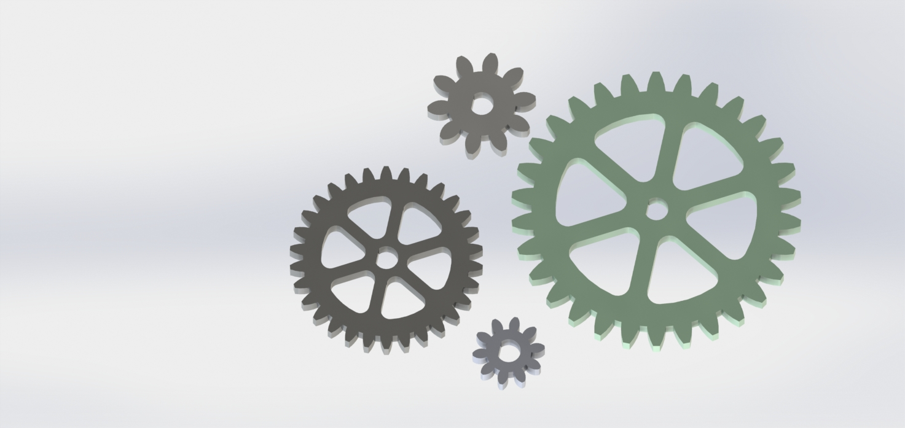
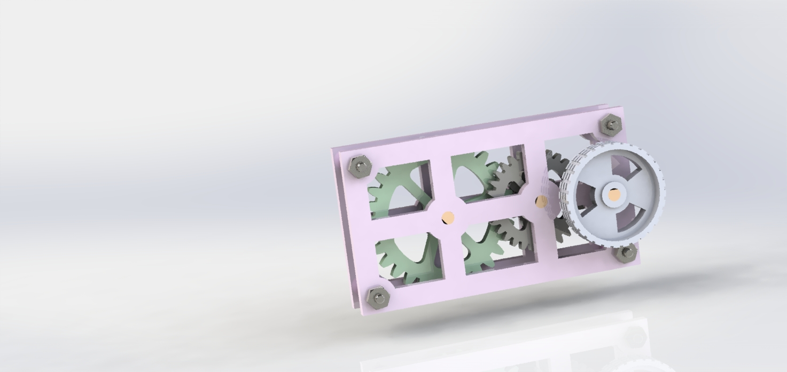

# AdvancedCAD

## Gears

### Description:
The purpose of this assignment was for us to learn how to use equations and how to make gears. This assignment ended up being much more helpful because the gearbox was based off of what we built during this assignment.
### Lessons Learned:
Before this assignment I had never built a gear before so seing the final product was very helpful, I knew SolidWorks had equations but I never truly understood their use, At first I had lots of trouble because I didn't put an equals sign before any of my dimensions so they never turned into equations. I also learned how to use global variables.
### Images

## Gearbox

### Description:
This assignment was built off the previous assignment by using the gears and having them connected and turning inside of a gearbox. I made assemblies for each of the different sizes of gears which were then going to be implanted into the box later on.
### Lessons Learned:
I didn't have much trouble with the pieces other than having to use math to figure out the correct distances so that the gears would fit in correctly and also fit inside the box. Before this assignment I never used a revolved cut, so when I was making the Knob it was very new to me, also, I had to learn what Gear Mates were so I could understand how to make the wheels turn.
### Images

## Motion Study

### Description:
The purpose of this assignment was for me to learn what a Motion Study was and how it could be used in different ways. In the assignment, I used lots of fillets which I didn't previously use as much.
### Lessons Learned:
This assignment helped me alot because I didnt make any holes and bases and midplane extrusions last year so this was a big refresher. I also learned about motion studies and that you can put gravity in SolidWorks to see if your motor or project would actually work in real life.
### Images

## Stress Analysis

### Description:
In this assignment I made a piece and had to use a stress analysis to see if it would bend and hold up if put under 4000N of stress. I also had to go back and change more and more pieces to see if it would hold up around the entire piece.
### Lessons Learned:
I never used SolidWorks simulation software and I wasn't planning on using it before this assignment. I had lots of trouble understanding each part of the software and what the Von Mises Stress showed and how I could fix the product without making it too big. I now know how to run the simulation software and if in the future I need to make something which shouldn't break then I can use it to check how strong my piece actually is.
### Images

